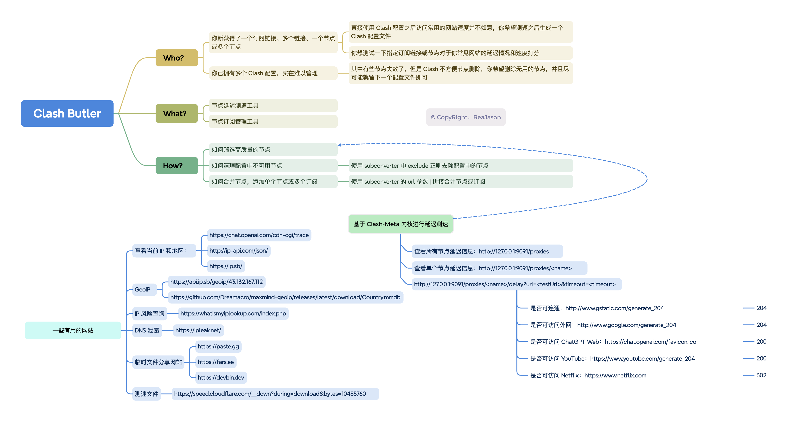

## Clash Butler

现在 Clash 配置文件如日中天，各种节点都有 Clash 配置文件格式，不过 Clash
对于用户界面的开发迭代并没有很快。

想之前用得最舒服的一个电脑端的代理软件还得是 [V2rayN](https://github.com/2dust/v2rayN)
，支持节点测速，测延迟，删除导出，自动排序等等（指节点管理这一块）。

作为一个「忠实的白嫖节点的人」，Clash 节点不允许做删除和新增，只能添加额外的配置，在大佬发新的节点会导致配置列表就会巨长，管理成本变高。

并且分享的节点基本是日抛类型，很快就会失效，不过一个订阅中个别链接又是可用的，
此时就急需一个工具来测速合并多个配置文件，且为了更好和 Clash 客户端配合，生成的链接需要固定的，似乎没有这方面的工具，不如咱就写一个吧？！



> [!IMPORTANT]
> 作为 Rust 初学者，这个项目一定会被做成好玩的模样，期待一起讨论一起学习 🎉

<p align="center">
  
  
  
</p>

## 快速开始

### 使用 GitHub Actions

1. Fork 当前项目。
2. 在自己项目中点击 Actions ，同意并打开 GitHub Actions 功能。
3. 在自己项目中 conf/config.toml 中填写需要合并的链接，提交 commit 之后会自动触发构建。
4. 等待 Actions 结束，项目中的 clash.yaml 就是最终筛选出来的节点信息。

### 本地构建

> [!WARNING]
> 精力有限，目前仅支持 MacOS 使用

1. 修改 config.toml，加入自己订阅地址
    ```yaml
   # 待测速的订阅节点
   # 支持网络地址 https://xxx
   # 支持本地地址（绝对地址）/User/xxx/xx.yml
   # 支持单个订阅链接，ss://xxx
   subs = [
      "https://xxx",
      "/User/xxx/xx.yml",
      "ss://xxx",
   ]
   ```

2. (可选) 关闭 clash tun 模式或全局模式
3. 使用 `cargo run` 启动，即可自动开始节点测速过滤

预计先写 CLI 批量跑完现有节点筛选节点的功能，再考虑后续写成 Web 部署自动化形式